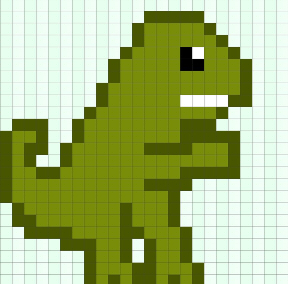
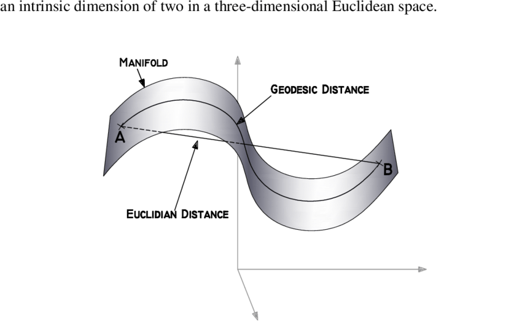
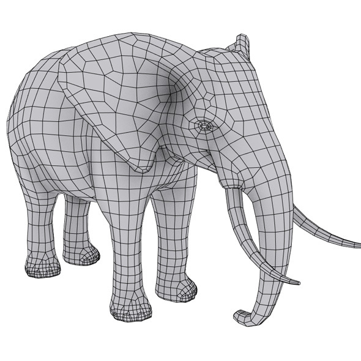
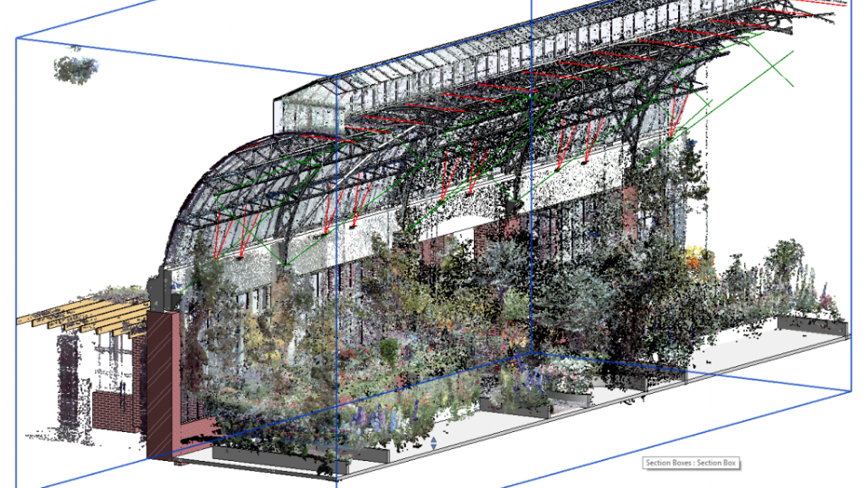

Geometric Deep Learning: Going Beyond Euclidean Data
-------------------------------------------------------
You can see the original paper in [here](https://arxiv.org/pdf/1611.08097.pdf).

# Euclidean vs Non-Euclidean

## 1.1 Euclidean 공간이란?

Euclidean 공간(혹은 Euclidean Geometry)란, 수학적으로 [유클리드]()가 연구했던 평면과 공간의 일반화된 표현입니다.

좁은 의미에서 유클리드 공간은, [피타고라스의 정의]()에 의한 길이소의 제곱의 계수가 모두 양수인 공간을 이야기합니다.
넓은 의미에서 유클리드 공간은, [그리드(Grid)]()로 표현이 가능한 모든 공간을 일컫습니다.
이 때 그리드(Grid)는, 시간과 공간적 개념을 모두 포함하며, 대표적인 예시로는 '2D 이미지', '3D Voxel', '음성' 데이터 등을 들 수 있습니다.

|  |  |  |
|:---:|:---:|:---:|
| **2D 이미지** | **3D Voxel** | **음성** |

## 1.2 Non Euclidean 공간이란?

문자 그대로 'Euclidean 공간이 아닌 공간'을 지칭하며, 대표적으로 두 가지를 들 수 있습니다.

### [1.2.1 Manifold](https://ko.wikipedia.org/wiki/%EB%8B%A4%EC%96%91%EC%B2%B4)

Manifold란, 두 점 사이의 거리 혹은 유사도가 근거리에서는 유클리디안(Euclidean metric, 직선거리)를 따르지만 원거리에서는 그렇지 않은 공간을 일컫습니다.

이해가 쉬운 가장 간단한 예로는, 구의 표면(2차원 매니폴드)를 들 수 있습니다.
3차원 공간에서 A점과 B점 사이의 유클리디안 거리(얇은 실선)와 실제의 거리(geodesic distance, 굵은 실선)는 일치하지 않는 것을 볼 수 있습니다.

이러한 Manifold 형태를 가지는 데이터의 대표적인 예시로는 mesh 혹은 point cloud 형태를 들 수 있습니다.

|  |  |
|:---:|:---:|
| **3D Mesh** | **Point cloud** |

### [1.2.2 Graph](https://en.wikipedia.org/wiki/Graph_\(discrete_mathematics\))

Graph란, 일련의 노드의 집합 **V**와 연결(변)의 집합 **E**로 구성된 자료 구조의 일종입니다.
일반적으로 노드에는 데이터가, 엣지엔 노드와 노드 사이의 관계 정보가 포함되어 있습니다.

일상적으로 볼 수 있는 Graph형 데이터의 예시로는 Social network 혹은 Brain functional connectivity network등이 있습니다.

|  |  |
|:---:|:---:|
| **Social Networks** | **Brain Functional Networks** |

|     용어     |        설명         |
|:------------:|:--------------------|
| sparse graph | node의 개수 > edge의 개수 | 
| dense graph  | node의 개수 < edge의 개수 |
| adjacent     | 임의의 두 node가 하나의 edge로 연결되어 있을 경우, 두 node는 서로 adjacent 하다 |
| incident     | 임의의 두 node가 하나의 edge로 연결되어 있을 경우, edge는 두 node에 incident 하다 |
| degree       | node에 연결된 edge의 개수 |

------------------------------------------------------------------------------------------------------------

# Spatial vs Spectral

우리 주변에서 많이 볼 수 있는 

기존에 다루던 Euclidean data (이미지, 음향 등)에서는 두 가지 특징이 성립했습니다.

- Grid structure
- Translational Equivalance/Invariance

예를 들어, 이미지 처리의 경우를 살펴봅시다.

이미지 I 가 (x,y) 에서 가장 중요한 classifier feature인 최대값 m 을 가진다고 가정합시다. 이 때, classifier의 가장 흥미로운 특징 중 하나는, 이미지를 왜곡한 distorted image I' 에서도 마찬가지로 classification이 된다는 점입니다.

예를 들어, 모든 벡터에 대해 translation (u,v)를 적용한다고 했을 때, translation된 새로운 이미지 I'의 최대값 m' 는 m과 동일하며, 최대값이 나타나는 자리 (x', y')는 (x-u, y-v)로 distortion에 대해 "equally" 변화한다는 것을 의미합니다.

| 용어 | 공식 | 설명 | 
|:---|:-----------------------|:---|
| Translational Equivalance | (x',y') = (x-u, y-v) | 변형에도 불구하고 같은 feature로 mapping 된다. |
| Translational Invariance | m' = m | 이미지에서의 변형식은 feature에서의 변형식과 대응된다. |

예를 들어, 우리가 흔히 사용하는 2D convnet은, translation에 대해서는 equivalent하나, rotation에 대해서는 equivalent하지 않습니다.

참고자료 : [참고자료1](https://www.slideshare.net/ssuser06e0c5/brief-intro-invariance-and-equivariance), 
[참고자료2](https://www.quora.com/What-is-the-difference-between-equivariance-and-invariance-in-Convolution-neural-networks)

### Invariance

CNN을 transformation-'invariant'하게 만들기 위해, training sample에 대한 data-augmentation을 수행합니다.

### Equivarance

- [Group Convnet](https://arxiv.org/pdf/1602.07576.pdf)
- [Capsule Net](https://arxiv.org/pdf/1710.09829.pdf), [CNN의 한계와 CapsNet에 관한 설명](https://jayhey.github.io/deep%20learning/2017/11/28/CapsNet_1/)

이런 기법들을 이용하여, 우리는 Translational한 구조의 데이터로부터 weight sharing을 가능하게 만들며, Grid based metric은 input 크기와 무관하게 적은 parameter의 개수로 이를 학습하는 것을 가능하게 만드는 CNN을 효과적으로 적용하여 학습시켜왔습니다.

그렇다면, 위의 두 조건이 충족되지 않는 Non-Euclidean data에 대해서는 어떻게 학습을 할 수 있을까요?

대표적으로 두 가지의 접근법이 있어왔는데, 한가지는 Spatial한 접근법이고, 한 가지는 Spectral한 접근법입니다.

- Spatial 접근 예시 : [Spectral Networks and Deep Locally Connected Networks on Graphs](https://arxiv.org/pdf/1312.6203.pdf)
- Spectral 접근 예시 : [Spectral CNN](http://www.cs.yale.edu/homes/spielman/561/)

## 2.1 Spacial Domain

기존에 알고 있던 그리드로 표현할 수 있는 데이터들은 대부분 Spacial Domain 에서 처리가 가능합니다.

대표적인 Spatial Domain에서의 처리는 이미지 인식에 이미 널리 알려진 Convolutional Neural Network가 존재합니다.

### 'Translational Equivarance/Invariance'란?

또한, 그리드로 정의되어 있지 않는 데이터 역시 spatial domain에서 처리하고자 하는 시도들이 존재한다.

대표적인 것으로 [Graph Attention Network](https://arxiv.org/pdf/1710.10903.pdf) 를 들 수 있습니다.

더 자세한 내용은 [4_Spatial_Graph_Convolution](../4_Spatial_Graph_Convolution)에서 다루겠습니다.

## 2.2 Spectral Domain

Spatial Domain 내에서 일정한 grid 를 가지지 않아 처리하기가 복잡한 데이터를 다루는 방법 중의 하나는 이를 spectral domain으로 사영시키는 것이다.

이는 Fourier Transformation 을 통해 이루어진다.

그래프 구조에서는, Laplacian 변환을 통해 spectral space의 basis를 구하며, normalization과 결합하여 아래와 같은 형태로 표현되게 됩니다.

더 자세한 내용은 [3_Spectral_Graph_Convolution](../3_Spectral_Graph_Convolution) 에서 다루겠습니다.
