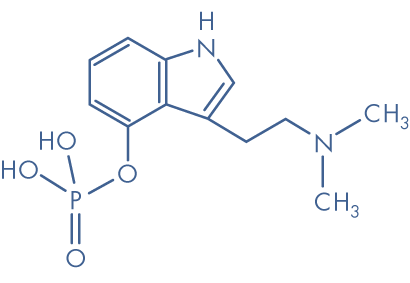
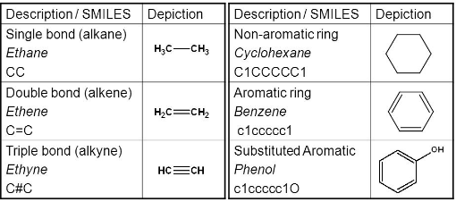

# Spectral Graph Convolutional Networks

## 기존의 CNN이 효과적으로 적용되던 조건
- Grid structure
- Translational Equivalance/Invariance

### 'Translational Equivarance/Invariance'란?

참고자료 : [equivarance vs invariance 참고자료 1](https://www.slideshare.net/ssuser06e0c5/brief-intro-invariance-and-equivariance), 
[equivariance vs invariance 참고자료 2](https://www.quora.com/What-is-the-difference-between-equivariance-and-invariance-in-Convolution-neural-networks)

이미지 I 가 (x,y) 에서 가장 중요한 classifier feature인 최대값 m 을 가진다고 가정하자. 이 때, classifier의 가장 흥미로운 특징 중 하나는, 이미지를 왜곡한 distorted image I' 에서도 마찬가지로 classification이 된다는 점이다.

예를 들어, 모든 벡터에 대해 translation (u,v)를 적용한다고 했을 때, translation된 새로운 이미지 I'의 최대값 m' 는 m과 동일하며, 최대값이 나타나는 자리 (x', y')는 (x-u, y-v)로 distortion에 대해 "equally" 변화한다는 것을 의미한다.


| 용어 | 공식 | 설명 | 
|:---|:-----------------------|:---|
| Translational Equivalance | (x',y') = (x-u, y-v) | 변형에도 불구하고 같은 feature로 mapping 된다. |
| Translational Invariance | m' = m | 이미지에서의 변형식은 feature에서의 변형식과 대응된다. |

예를 들어, 우리가 흔히 사용하는 2D convnet은, translation에 대해서는 equivalent하나, rotation에 대해서는 equivalent하지 않다.

CNN을 transformation-'invariant'하게 만들기 위해, training sample에 대한 data-augmentation을 수행한다.

#### Equivarance

- [Group Convnet](https://arxiv.org/pdf/1602.07576.pdf)
- [Capsule Net](https://arxiv.org/pdf/1710.09829.pdf), [CNN의 한계와 CapsNet에 관한 설명](https://jayhey.github.io/deep%20learning/2017/11/28/CapsNet_1/)

#### Invariance

```bash
Spectral Networks and Deep Locally Connected Networks on Graphs
```

## Graph Convolutional Networks

Social Networks, Knowledge Graphs, Protein interaction networks, World Wide Web 등, 우리 주변의 많은 데이터들은 그래 프 구조를 지니고 있습니다.
대부분의 Graph Neural Network 모델들은 공통된 구조를 가지고 있고, 그래프의 모든 위치에 대해 공유된 필터를 사용한다는 점에 착안하여 CNN(Convolutional Neural Network)와 마찬가지로 이를 GCN(Graph Convolutional Networks)라고 합니다.

<p align="center"></p>

Graph Convolutional Networks의 목표는, G=(V, E) (여기서, V는 Vertex, 즉 노드의 표현형이며, E는 Edge, 각 변 혹은 엣지의 표현형입니다.)로 표현되는 그래프 데이터에서 특정 시그널이나 feature를 잡는 함수를 학습하는 것입니다.

**Input**
- N x D 차원의 feature vector (N : Number of nodes, D : number of input features)
- Graph의 구조를 반영할 수 있는 매트릭스 형태의 표현식; 일반적으로 adjacency matrix A 를 사용합니다.

**Output**
- N x F 차원의 feature 매트릭스 (N : Number of nodes, F : number of output features)

각 뉴럴 네트워크의 계층은 이런 input을 ReLU 혹은 pooling 등의 non-linear function ***f*** 를 적용합니다.

<p align="center"></p>

***f*** 함수를 어떻게 결정하고 parameter화 시키냐에 따라  와 , 로부터 원하는 특정 모델을 구상할 수 있게 됩니다.

이번 튜토리얼에서 사용할 GCN 구조는 아래와 같습니다.

<p align="center"></p>

Non-linear activation function 으로는 ReLU (Rectified Linear Unit)를 사용하며, 이를 통해 아래의 식을 도출할 수 있습니다.

<p align="center"></p>

***A*** 와의 곱은 각 노드에 대해 자기 자신을 제외한(self connection이 존재하지 않는다는 가정 하에) 모든 인접 노드의 feature vector를 합하는 것을 의미합니다.

이와 같은 방식에선, 스스로의 feature 값을 참조할 수 없으므로, 이를 해결하기 위하여 ***A*** 를 사용하는 대신 ***A+I*** (A_hat) 을 사용하여 계산합니다.

***A*** 는 일반적으로 normalize가 되어있지 않은 상태이므로, ***A*** 와의 곱은 각 feature vector의 scale을 완전히 바꿔놓을 수 있게 됩니다.

따라서, 우리는 이전에 기술한 것과 마찬가지로 ***A*** 의 모든 열의 합이 1 이 될 수 있도록 row-wise normalize를 feature와 adjacency matrix에 각각 진행합니다.

이는 random walk 방식으로는 이 되며, 원 논문에서 사용한 방식으로는

<p align="center"></p>

가 됩니다.

각 단계의 계산과정이 코드 상에 어디에 해당하는지는 [gcn.py](./gcn.py) 코드 내에 주석으로 삽입하였습니다.

**최종 구현 :**

위의 모든 구현 이론을 종합하여 [Kipf & Welling](http://arxiv.org/abs/1609.02907) (ICLR 2017) 논문에서 소개한 Graph Convolutional Neural Network 를 구현하였습니다.

더 많은 세부 정보를 위해서는, [여기](https://tkipf.github.io/graph-convolutional-networks/)를 참조하시면 좋을 것 같습니다.

## Molecule Structure Processing

<p align="center"></p>

Graph Structure 데이터의 가장 대표적인 예로는, 분자 구조가 존재할 수 있습니다.

이전 neural network 구조에서는, 분자 구조를 사용할 때는 ECFP (Extended Connectivity FingerPrint)를 사용하여 고정된 형식의 벡터 표현식을 이용해왔습니다. [예시자료](https://arxiv.org/pdf/1811.09714.pdf)

그러나, 이는 Graph 단위에서 특정 요소가 존재하는지의 여부에 대한 표현식이므로, 분명한 한계가 존재할 수 밖에 없습니다.

이와 같은 그래프 형태의, non-Euclidean graph 데이터의 구조를 Graph Convolution network를 통하여 학습할 수 있습니다.

본 튜토리얼에서는 이를 처리하여 고정된 형식의 벡터를 만드는 forward path를 소개하며, 이후 이를 활용하는 것은

마지막 layer의 vector를 연결하여 [classification](https://arxiv.org/pdf/1805.10988.pdf)을 하거나, [fingerprint](https://arxiv.org/pdf/1509.09292.pdf)를 만들거나, siamese network를 구상하여 [유사도를 측정](https://arxiv.org/pdf/1703.02161.pdf)할 수 있습니다.

그러나, 분자 구조에는 edge가 위처럼 2차원의 단순한 adjacency matrix에서 표현되지 못합니다.
Edge에도 여러가지 type이 존재하기 때문입니다.

## Graphs with Mulitple Type Edges

분자 구조의 경우에는, Edge (Bond라고 표현합니다)가 여러가지 type을 가질 수 있습니다. 가장 대표적인 것으로는 single, double, triple, aromatic 등의 bond type이 있습니다.

<p align="left"></p>

이런 경우에는, 일반적으로 Aggregation 이라는 방법을 통해 데이터를 처리합니다. [reference](https://arxiv.org/pdf/1806.02473.pdf)

```bash
$ python molecule_gcn.py
```

위의 코드는, 튜토리얼 내에서 지정한 임의의 pid를 가진 molecule vector를 [RDkit](https://www.rdkit.org/)을 통해 graph 형태로 표현한 뒤, 이를 GCN forward path 에 대입하여 100차원의 feature vector를 생성하는 과정입니다.

## Train Planetoid Network

아래의 script를 실행시키면, 원하시는 데이터셋에 GCN 을 학습시키실 수 있습니다.

[2_Understanding_Graphs](../2_Understanding_Graphs) 에서 설명한 것과 같이 Planetoid 데이터셋을 다운로드 받으신 후, [:dir to dataset] 에 대입하여 실행하시면 됩니다.

기본 default 설정은 2_Understanding_Graphs 의 /home/[:user]/Data/Planetoid 디렉토리로 설정되어 있습니다.

```bash
python train.py --dataroot [:dir to dataset] --datset [:cora | citeseer | pubmed]
```

## Test (Inference) Planetoid networks

Training 과정을 모두 마치신 이후, 다음과 같은 코드를 통해 학습된 weight를 테스트셋에 적용해보실 수 있습니다.

```bash
python test.py --dataroot [:dir to dataset] --dataset [:cora | citeseer | pubmed]
```

## Result

최종 성능은 다음과 같습니다. GCN (recon) 이 본 repository의 코드로 학습 후, test data 에 적용한 결과입니다.

| Method      | Citeseer | Cora | Pubmed |
|:------------|:---------|:-----|:-------|
| GCN (rand)  | 67.9     | 80.1 | 78.9   |
| GCN (paper) | 70.3     | 81.5 | 79.0   |
| GCN (recon) | 70.6     | 80.9 | 80.8   |
