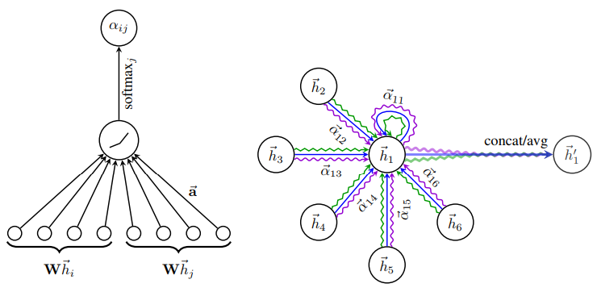
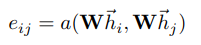
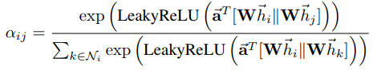

# Spatial Graph Convolutional Networks

Non-Euclidean data를 해결하기 위한 두 번째 방법은, Spatial domain 내에서 해결하는 접근법입니다.
그 중 대표적인 것이 [Graph Attention Network](https://arxiv.org/pdf/1710.10903.pdf)입니다.

## Graph Attention Networks

<p align="center"></p>

Graph Attention Networks는 spatial 하게 인접한 노드들에 attention weight를 부과하여 이를 통해 각 노드를 표현한다.

위 그림에서, 가장 먼저 shared linear transformation, parameterized weight matrix W 를 구해야 합니다.

서로 다른 노드와 자신과의 self-attention을 통해 우리는 다음과 같은 식을 얻습니다.

<p align="left"></p>

코드 상에서 이 식은 다음과 같습니다.

```bash
h = torch.mm(input, self.W)

# a1, a2 = (out_features x 1)
f_1 = torch.matmul(h, self.a1)
f_2 = torch.matmul(h, self.a2)
e = f_1 + f_2.transpose(0,1)
```

여기에 negative input slope 가 0.2 인 LeakyReLU non-linearity를 적용하고, normalize를 시켜줍니다.

(normalize 방법으론 일반적으로 softmax를 이용합니다.)

<p align="left"></p>

코드 상에서 이 식은 다음과 같습니다.

```bash
e = self.leakyrelu(e)
attention = torch.where(adj > 0, e, zero_vec)
attention = F.softmax(attention, dim=1)
```

학습의 안정성을 위하여, 본 논문에서는 multi-head attention을 진행합니다.

마지막 layer 이전 모든 layer에서는 이 작업을 head 의 개수만큼 반복하여 concat 하여 주고,

마지막 layer에서는 head의 개수만큼 발생한 output의 average를 취해줍니다.

<p align="left"></p>

코드 상에서 이 식은 다음과 같습니다.

```bash
self.attentions = [GraphAttention(nfeat, nhid, dropout=dropout, alpha=alpha, concat=True) for _ in range(nheads)] # concat
self.out_att = [GraphAttention(nhid * nheads, nclass, dropout=dropout, alpha=alpha, concat=False) for _ in range(nouts)]

# Output layer 가 아닌 layer의 경우
x = torch.cat([att(x, adj) for att in self.attentions], dim=1) # concat

# Output layer 의 경우
x = torch.mean(torch.stack([att(x, adj) for att in self.out_att], dim=1), dim=1) # avg (for pubmed)
```

Normalize 는 Xavier Initialization 의 다른 이름인 'Glorot Initialization'을 사용했으며,

Transductive task의 경우
```bash
# cora, citeseer
nvidia-docker run -it bumsoo python 4_Spatial_Graph_Convolution/train.py --dataset [:dataset] --weight_decay 5e-4 --dropout 0.6 --nb_heads 8 --nb_outs 1

# pubmed (용량을 매우 많이 차지하므로 느리더라도 CPU 학습을 추천합니다.)
docker run -it bumsoo python 4_Spatial_Graph_Convolution/train.py --dataset pubmed --weight_decay 1e-3 --dropout 0.6 --nb_heads 8 --nb_outs 8
```

## Train Planetoid Network

| dataset | classes | nodes | # of  edge  |
|:-------:|:-------:|:-----:|:-----------:|
| citeseer| 6       | 3,327 | 4,676       |
| cora    | 7       | 2,708 | 5,278       |
| pubmed  | 3       | 19,717| 44,327      |


이전 튜토리얼과 마찬가지로, [2_Understanding_Graphs](../2_Understanding_Graphs) 에서 다루었던 Planetoid의 데이터셋에 대해 학습을 해보겠습니다.

아래의 script를 실행시키면, 원하시는 데이터셋에 GCN 을 학습시키실 수 있습니다.

[2_Understanding_Graphs](../2_Understanding_Graphs) 에서 설명한 것과 같이 Planetoid 데이터셋을 다운로드 받으신 후, [:dir to dataset] 에 대입하여 실행하시면 됩니다. (Dockerfile 에서 자동적으로 데이터를 받아 필요한 경로로 이동시켜줍니다)

기본 default 설정은 2_Understanding_Graphs 의 /home/[:user]/Data/Planetoid 디렉토리로 설정되어 있습니다.

이전 2번 튜토리얼 레포에서 보셨던 데이터의 전처리에 관한 사항은, [utils.py](utils.py) 에서 확인해보실 수 있습니다.

```bash
# nvidia docker run -it bumsoo-graph-tutorial /bin/bash 실행 이후
> python train.py --dataroot [:dir to dataset] --datset [:cora | citeseer | pubmed]

# 바로 실행하는 경우
$ nvidia-docker run -it bumsoo python 4_Spatial_Graph_Convolution/train.py --dataset pubmed --lr 0.01 --weight_decay 1e-3 --nb_heads 8
$ nvidia-docker run -it bumsoo python 4_Spatial_Graph_Convolution/train.py --dataset [:else] --lr 5e-3
```

## Test (Inference) Planetoid networks

Training 과정을 모두 마치신 이후, 다음과 같은 코드를 통해 학습된 weight를 테스트셋에 적용해보실 수 있습니다.

```bash
# nvidia docker run -it bumsoo-graph-tutorial /bin/bash 실행 이후
> python test.py --dataroot [:dir to dataset] --dataset [:cora | citeseer | pubmed]

# 바로 실행하는 경우
$ nvidia-docker run -it bumsoo python 4_Spatial_Graph_Convolution/test.py --dataset [:dataset]
```

## Result

800 epoch 후 학습된 최종 성능은 다음과 같습니다.

GAT (recon) 이 본 repository의 코드로 학습 후, test data 에 적용한 결과입니다.

| Method      | Citeseer | Cora | Pubmed |
|:------------|:---------|:-----|:-------|
| GCN (rand)  | 67.9     | 80.1 | 78.9   |
| GCN (paper) | 70.3     | 81.5 | 79.0   |
| GAT (paper) | 72.5     | 83.0 | 79.0   |
| **GAT (recon)** | **72.2**     | **82.2** | **78.6**   |
